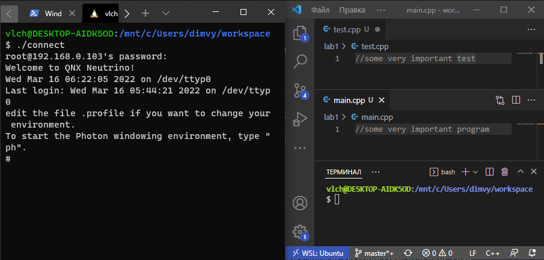

# QNX remote repo

Contains scripts for syncronization and interaction with remote QNX.

## Prerequisites
1. Linux or WSL,
2. VS Code or any editor.

## First run
```bash
#create workspace and run following from created directory
git clone git@github.com:vlchgfx/RTOS.git
./init
```

## Setting up connection
After executing _init_ script u can setup settings.cfg for your connection.
| Property		        | Description					    |
|:---------------------:|:---------------------------------------------:|
| RTOS_WORKSPACE 	| absolute path to yout workspace directory	|
| RTOS_WORKSPACE_NAME	| workspace name				|
| RTOS_HOST		| remote QNX host (localhost by default		|
| RTOS_PORT		| ssh connection port (set same as on your VM)	|
| RTOS_USER		| remote qnx username ('root' by default	|

## Usage
After initialisation and configuring settings.cfg you can use other scripts:
1. sync - for syncing remote remote workspace with local,
2. connect - for establish ssh connection to remote QNX.

## Example
Using ./connect from WSL terminal to establish ssh connection.


Using ./sync from WSL VS Code to sync workspaces.


## Troubleshooting
There are no problems to solve.
